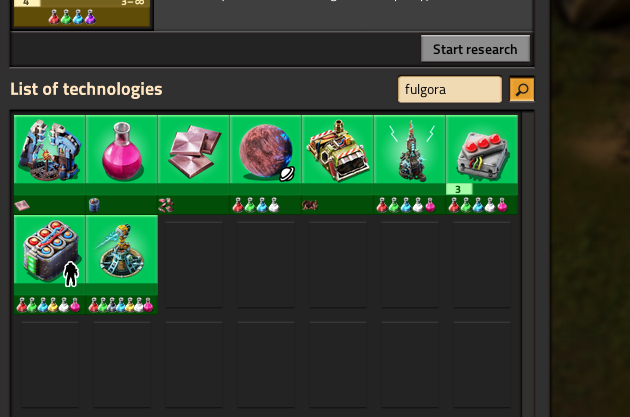
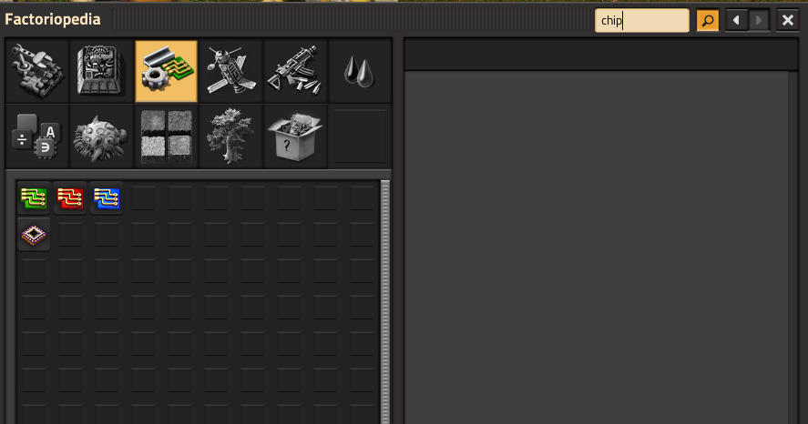
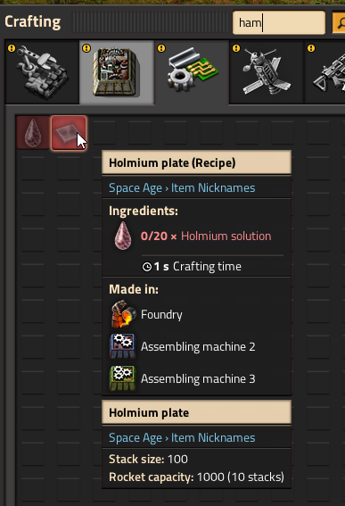

# Item Nicknames

Add extra search words to Factorio prototypes without changing the visible name on screen. Type a nickname in the crafting menu, technology browser, Factoriopedia, or blueprint picker and the real item, recipe, fluid, technology, or planet still shows up.

Nicknames are appended in an invisible font, so tooltips and on-map labels look normal while search picks up your aliases.

## Quick start

1. Enable **Item Nicknames**.
2. Click the **Item Nicknames** shortcut on the shortcut bar.
3. Add rows: pick a target, choose which prototype types apply, enter nicknames.
4. Press **Export**, copy the IN1 string.
5. Open **Settings → Mod settings → Startup → Custom Nicknames**, paste the string, and **restart Factorio**.

Until you paste into the startup setting and restart, nickname changes from the editor are only saved as a draft in your save.

## What you can nickname

Items, entities, recipes, fluids, equipment, tiles, space locations (planets), virtual signals, asteroid chunks, and technologies. One row can apply to several types when the same prototype name exists in more than one category (for example a fluid and its barrel item).

## Nickname packs

Other mods may ship optional nickname lists. Open **Nickname packs** in the editor to preview or edit a pack, then paste its exported string into that pack's startup setting (names like **Example nicknames**).

Pack nicknames always merge when their setting has content. They are not blocked by **Allow mod nicknames**.

## Startup settings

| Setting | Purpose |
|---------|---------|
| **Custom Nicknames** | Your personal aliases (IN1 string from the editor). |
| **Allow mod nicknames** | When off, other mods cannot add nicknames through the programmatic API. Packs and Custom Nicknames still work. |
| **Allow mod nickname overwrites** | When off, other mods cannot remove API nickname tokens. Your Custom Nicknames are always protected. |

## Screenshots

## Optional example content

See **[Item Nicknames: Example Pack](https://mods.factorio.com/mod/item-nicknames-example)** for a ready-made list of vanilla and Space Age aliases you can enable, edit, or turn off.

## Note - the screenshots use the data from Item Nicknames: Example Pack. This mod does not ship with any built-in nicknames.

## Mod authors

Integration through nickname packs and a data-stage API is documented in the [GitHub README](https://github.com/djfariel/item-nicknames).
